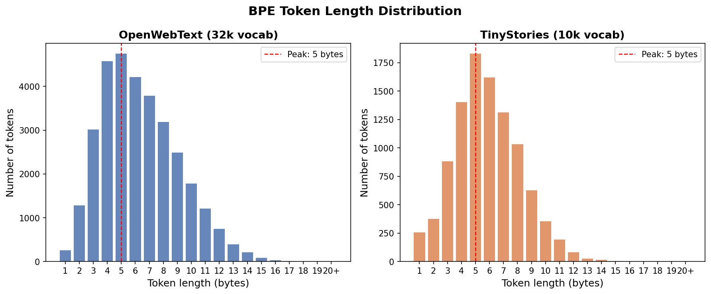

## Problem (unicode1)
```
>>> chr(0)
'\x00'
>>> repr(chr(0))
"'\\x00'"
>>> print(chr(0))

>>> "this is a test" + chr(0) + "string"
'this is a test\x00string'
>>> print("this is a test" + chr(0) + "string")
this is a teststring
```

(a) `chr(0)` returns the unicode character '\x00', which is 0.
(b) `repr(chr(0))` outputs a readable, escape-sequenced code "'\\x00'", whereas the printed representation is blank.
(c) If it's printed it's invisible, but it's visible when using repr().


## Problem (unicode2)
```
>>> test_string = "hello my name is michael"
>>> utf8_encoded = test_string.encode("utf-8")
>>> print(utf8_encoded)
b'hello my name is michael'
>>> utf16_encoded = test_string.encode("utf-16")
>>> utf32_encoded = test_string.encode("utf-32")
>>> len(list(utf8_encoded))
24
>>> len(list(utf16_encoded))
50
>>> len(list(utf32_encoded))
100
```
(a) UTF-8 encoded bytes is shorter / more compact.

(b) This treats each byte independently and tries to decode it as a full UTF-8 character. However, UTF-8 is variable-length encoding and one character could map to more than one byte.

```
>>> decode_utf8_bytes_to_str_wrong("你好".encode("utf-8"))
Traceback (most recent call last):
  File "<stdin>", line 1, in <module>
  File "<stdin>", line 2, in decode_utf8_bytes_to_str_wrong
UnicodeDecodeError: 'utf-8' codec can't decode byte 0xe4 in position 0: unexpected end of data
```

(c)  2-byte sequences must start with `110xxxxx`, so the sequence b'\x80\x80' would fail.
```
>>> b'\x80\x80'.decode("utf-8")
Traceback (most recent call last):
  File "<stdin>", line 1, in <module>
UnicodeDecodeError: 'utf-8' codec can't decode byte 0x80 in position 0: invalid start byte
```

## Problem (train_bpe_tinystories)

(a) It takes 5 minutes to run on CPU. The longest token in the vocab is b' accomplishment'.

(b) get_pair_to_merge function takes the most time (73% of total). It's called once per merge and each call iterates over all pairs.


# Problem (train_bpe_expts_owt)

(a) Training on 5000 documents took 28 minutes. The longest token in the vocabulary is '—————————————————————-' (length 64). From inspecting the file, seems like many documents are using '—————————————————————-' as visual separator.

(b) 69.6% of TinyStories tokens exist in OpenWebText's vocab, but only 21.7% of OpenWebText's vocab exist in TinyStories. This makes sense since OWT's tokenizer underwent 3.2x more merges so it learned more tokens that TinyStories didn't. And most TinyStories merges OWT also learned.
Both tokenizers peak at 5 bytes, but OWT has a heavier right tail with more tokens up to 13+ bytes.




# Problem (tokenizer_experiments)

(a) The compression ratio for the TinyStories tokenizer on 10 documents from TinyStories is 4.14.
The compression ratio for the OpenWebText tokenizer on 10 documents from OpenWebText is 4.43.

(b) OpenWebText with TinyStories tokenizer gets a compression ratio of 3.06. It gets a lower bytes/token ratio because the TinyStories tokenizer was trained less (underwent less merges), so it didn't learn many merges that OpenWebText did, thus it must split words more when operating on OpenWebText.

(c) The tokenizer took 5 minutes to tokenize the tinystories dataset (23.7 MB). 825,000 MB / 4.74 MB = 174,000 minutes = 121 days. So a really really long time on a single CPU without heap optimization.

(d) uint16 is more memory efficient and also fits the vocab size.


# Problem (transformer_accounting)

(a) vocab_size = 50,257, context_length = 1024, num_layers = 48, d_model = 1600, num_heads = 25, d_ff = 6400.

Parameters in embedding layer: 50,257 x 1600 = 80,411,200
Attention $W_Q$, $W_K$, $W_V$, $W_O$ all 1600 x 1600. 4(1600 x 1600) = 10,240,000
Feed-forward: 1600 x 6400 + 6400 x 1600 = 20,480,000
Total per transformer block is about: 10,240,000 + 20,480,000 = 30,720,000

Total is about: (48 x 30,720,000) + 80,411,200 = 1,554,971,200 =~ 1.5B parameters

(b)

Attention projections:
- $W_Q x$: (d x d)(T x d) = $2Td^2$
- $W_K x$: (d x d)(T x d) = $2Td^2$
- $W_V x$: (d x d)(T x d) = $2Td^2$
- $QK^T$: (T x d)(d x T) = $2T^2d$
- Attention weighted value: (T x T)(T x d) = $2T^2d$
- Output projection: (T x d)(d x d) = $2Td^2$

Altogether attention: $8Td^2$ + $4T^2d$

Feedforward:
- 1st layer: (T x d)(d x $d_{ff}$) = $2Tdd_{ff}$
- 2nd layer: (T x $d_{ff}$)($d_{ff}$ x d) = $2Tdd_{ff}$

Total = $4Tdd_{ff}$

Total per layer: $8Td^2$ + $4T^2d$ + $4Tdd_{ff}$

Total: L($8Td^2$ + $4T^2d$ + $4Tdd_{ff}$)

Plug in 48 for L, 1024 for T, 1600 for d, and 6400 for $d_{ff}$

Total FLOPs: 3.34 × $10^{12}$

(c) The sequence length is small relative to model width, so the FFN requires the most FLOPs, hence why we do MoE on the FFN sometimes!

(d)
Assuming standard GPT-2 configs where $d_{ff}$ = 4d_model,

GPT-2 small: num_layers = 12, d_model = 768, num_heads = 12, d_ff = 3072

12 (8 x 1024 x $768^{2}$ + 4 x $1024^{2}$ x 768 + 4 x 1024 x 768 x 3072) =~ 2.13 x $10^{11}$ FLOPs

GPT-2 large: num_layers = 36, d_model = 1280, num_heads = 20, d_ff = 5120

36 (8 x 1024 x $1280^{2}$ + 4 x $1024^{2}$ x 1280 + 4 x 1024 x 1280 x 5120) =~ 1.64 x $10^{12}$ FLOPs

As model size increases, the FFNs and linear projection layers take up proportionally more total FLOPs because they scale quadratically with d_model.

(e)

48 (8 x 16384 x $1600^{2}$ + 4 x $16384^{2}$ x 1600 + 4 x 16384 x 1600 x 6400)

The FLOPs become dominated by the attention score calculations since they scale quadratically with context length.

